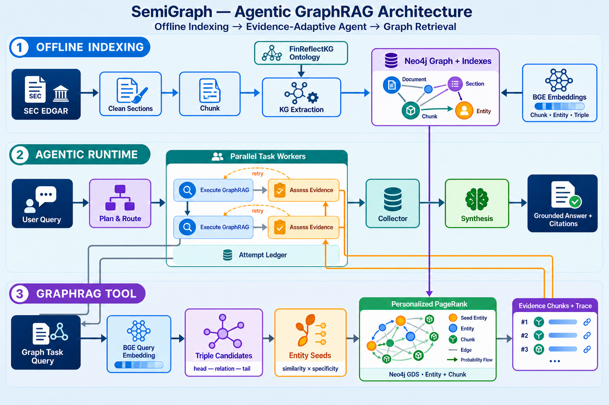

# SemiGraph

**Agentic Heterogeneous GraphRAG for evidence-grounded semiconductor fundamental analysis.**

SemiGraph is a KMUTNB computer science senior thesis project. It studies whether
an evidence-adaptive Agent can answer multi-hop questions over semiconductor
company disclosures more effectively than a conventional vector-only RAG
pipeline.

The contribution is retrieval and Agent engineering—not a new investment
strategy. SemiGraph connects an ontology-grounded knowledge graph, filing-chunk
retrieval, structured financial facts, and news evidence through one auditable
Agent workflow. It is a research prototype and does not provide investment
advice.

## Research Positioning

Financial questions often require evidence that is split across filings and
connected through entities such as companies, products, suppliers, risks, and
geographies. Vector similarity is useful for finding locally relevant text, but
it does not explicitly model those relationships.

SemiGraph therefore frames the main comparison as **Agentic Heterogeneous RAG
vs. Homogeneous Vector RAG** through three controlled configurations:

| Configuration | Retrieval | Controller | Purpose |
|---|---|---|---|
| **Vanilla Vector RAG** | Filing chunks by vector similarity | Single retrieval pass | Homogeneous baseline |
| **Agentic Vector RAG** | Vector retrieval only | Plan, assess evidence, and retry | Isolate the value of the Agent controller |
| **Agentic Heterogeneous RAG** | Graph, vector, structured financial, and news tools | Evidence-adaptive Agent | Test retrieval across different evidence types |

This separation matters: Graph retrieval and Agent control are different
variables. SemiGraph evaluates them independently instead of treating every
gain as a generic “GraphRAG improvement.”

## Architecture



The figure intentionally zooms into the core SEC-to-GraphRAG path. Financial
and news tools are omitted from the diagram to keep the Graph retrieval flow
readable; the full Agent still exposes `graph`, `vector`, `financial`, and
`news` retrieval adapters.

### 1. Offline indexing

```text
SEC EDGAR 10-K
  → clean and extract Item 1 / Item 1A / Item 7
  → token-aware chunks
  → one structured LLM extraction per chunk
  → Pydantic + ontology validation
  → Neo4j knowledge graph with source provenance
  → chunk, entity, and relationship-triple embeddings
  → synonymy, node specificity, and reusable GDS projection
```

The graph schema is defined only in
[`src/semigraph/ontology/schema.py`](src/semigraph/ontology/schema.py). It
adopts the FinReflectKG ontology and adds provenance nodes such as `Document`,
`Section`, and `Chunk`. Extracted relationships retain their filing, ticker,
fiscal year, section, and source-chunk lineage.

### 2. GraphRAG retrieval

The Graph Search Tool closes the path from a natural-language query back to
evidence chunks:

```text
query
  → BGE query embedding
  → query-to-triple candidates
  → head/tail entity seeds
  → Personalized PageRank over Entity + Chunk topology
  → ranked evidence chunks + stage-level trace
```

Neo4j GDS runs `gds.pageRank.stream` from query-specific `sourceNodes` over a
reusable projection. The projection connects domain entities, filing chunks,
`MENTIONS`, and `SYNONYM_OF` edges, so PPR can rank passages as part of the
graph walk instead of mapping entities back to text only after traversal.

The effective Graph profile—including seed mode, PPR topology, seed weighting,
candidate budget, optional triple filtering, and reranking—is configured in
[`config/default.yaml`](config/default.yaml). Retrieval traces record the
parameters that actually ran; benchmark claims should use those traces rather
than infer settings from an old report.

### 3. Evidence-adaptive Agent

The current LangGraph runtime is:

```text
User Query
  → PlanRoute
  → bounded parallel Task Workers
       Execute retrieval → Assess evidence
               ↑              │
               └── retry ─────┘
  → deterministic Collector
  → one grounded Synthesis
  → Answer + Citations
```

`PlanRoute` turns the question into evidence requirements and retrieval
actions. Each isolated worker records every attempt in an append-only
`Attempt Ledger`. `Assess` may accept, stop, or propose a validated next action
when evidence is missing. The Collector restores plan order before Synthesis,
so parallel completion order does not silently change the final context.

Every retrieval adapter returns the same contract:

```text
{ chunks, trace }
```

An `AttemptRecord` binds the requested action, retrieval status, raw chunks,
retrieval trace, and assessment. This makes tool choice, retries, accepted
evidence, and final citations inspectable without exposing hidden
chain-of-thought.

## Heterogeneous Evidence Tools

| Tool | Evidence source | Current role |
|---|---|---|
| **Graph Search** | Neo4j entities, relationships, chunks, and GDS PPR | Multi-hop relational retrieval |
| **Vector Search** | Neo4j chunk vector index | Homogeneous baseline and semantic passage retrieval |
| **Financial Search** | Typed PostgreSQL views populated from Finnhub | Deterministic reported, derived, and snapshot metrics |
| **News Search** | Finnhub company news | Recent event context with source metadata |

Financial numerics are kept out of the narrative KG as the authoritative value
store. The graph may contain financial concepts such as “gross margin,” while
PostgreSQL owns the reported number and period.

## Evaluation

SemiGraph evaluates retrieval and answer quality as separate layers:

- **Retrieval:** Chunk Hit, Recall, evidence-group coverage, `Answerable@K`,
  MRR, latency, and retrieval-call budget.
- **Agent:** requirement coverage, retry behavior, evidence gain, duplicate
  retrieval, tool calls, and stop reasons.
- **Answer:** human-reviewed answer points, faithfulness, factual correctness,
  and citation validity.
- **Controlled ablations:** the same corpus, model, graph, top-k/context
  budget, and evaluation questions are held fixed whenever possible.

The repository contains FinReflectKG/SOX controlled datasets, retrieval-only
results, Agent results, and human-review artifacts. A controlled corpus result
is not presented as a full production end-to-end result.

See [`benchmark/README.md`](benchmark/README.md) for dataset contracts and the
reproducible retrieval command.

## Project Layout

```text
src/semigraph/
├── ontology/      # FinReflectKG-based schema and validated graph models
├── offline/       # SEC ingest, preprocessing, chunking, extraction, storage
├── online/        # graph, vector, financial, news, rerank, and PPR retrieval
├── agent/         # PlanRoute, workers, Assess, retry policy, ledger, synthesis
├── financial/     # Finnhub ETL, typed query spec, SQL compiler, PostgreSQL
├── benchmark/     # benchmark adapters and normalization
├── config.py      # cached YAML + .env configuration boundary
└── connections.py # Neo4j, embedding, and LLM factories

config/default.yaml    # operational parameters; .env contains secrets
scripts/               # ingestion, indexing, traces, smokes, and evaluators
eval_scripts/          # controlled Vector/Graph/Agent evaluation harnesses
benchmark/             # versioned datasets and result artifacts
docs/                  # architecture, ADRs, specifications, and review UI
```

## Quick Start

### Prerequisites

- Python 3.10 or newer
- Docker Compose
- Neo4j 5.26 Community with APOC and Graph Data Science plugins
- An API key for the LLM provider selected in `config/default.yaml`

Create the environment and install the package:

```bash
conda create -n senior_project python=3.10
conda activate senior_project
pip install -e .
```

Create a project-root `.env` for the core SEC + GraphRAG path:

```env
OPENROUTER_API_KEY=...

NEO4J_URI=bolt://localhost:7687
NEO4J_USER=neo4j
NEO4J_PASSWORD=...

EDGAR_EMAIL=your@email.com
EDGAR_ORGANIZATION=Your Organization
```

`FINNHUB_API_KEY` and PostgreSQL credentials are required only when using the
financial or news paths. Secrets are read through `Config`; application code
should not read environment variables directly.

Start the GraphRAG database and verify connectivity:

```bash
docker compose up -d neo4j
python scripts/test_neo4j_connection.py
```

Run unit tests that do not require external services:

```bash
pytest tests/ -v
```

## Common Workflows

### Onboard one 10-K ticker

The pilot downloads filings, preprocesses sections, extracts the KG, builds
embeddings, computes graph features, verifies Neo4j, and records metrics:

```bash
python scripts/pilot.py --ticker KLAC --workers 8
```

The implemented ingestion path is 10-K-centric. Foreign issuers that file
20-F require a separate section parser before using the same pipeline safely.

### Manage the reusable PPR projection

```bash
python scripts/manage_ppr_projection.py status entity_chunk
python scripts/manage_ppr_projection.py prepare entity_chunk
```

Refresh the projection after the stored graph changes:

```bash
python scripts/manage_ppr_projection.py refresh entity_chunk
```

### Trace one Agent query

```bash
python scripts/run_agent_trace.py \
  "How exposed is AMD to TSMC supply risk?" \
  --show-citations \
  --show-retrieval-traces
```

### Compare retrieval backbones

```bash
python scripts/evaluate_retrieval_quality.py \
  --tools vector graph hybrid \
  --top-k 5 \
  --oracle-k 20
```

## Design Boundaries

- SemiGraph is a research system for evidence retrieval and synthesis, not a
  trading engine or buy/sell recommender.
- A graph relationship is retrieved evidence, not proof of causality.
- HippoRAG-style triple linking and PPR are foundations. SemiGraph's project
  contribution is their integration with domain constraints, heterogeneous
  evidence, adaptive retrieval control, provenance, and controlled evaluation.
- Tunable runtime values belong in `config/default.yaml`; secrets belong in
  `.env`.
- Generated corpora, local database volumes, credentials, and temporary Agent
  artifacts must not be committed.

## Documentation

- [Interactive source-grounded architecture](docs/architecture-viz/README.md)
- [Evidence-adaptive Agent specification](docs/spec_agent_harness_evidence_adaptive.md)
- [ADR 0001 — LLM-owned tool selection](docs/adr/0001-llm-owned-tool-selection.md)
- [ADR 0002 — tool-aware evidence retry](docs/adr/0002-evidence-adaptive-tool-aware-retry.md)
- [Offline pipeline reference](docs/offline_pipeline.md)
- [Benchmark datasets and reproducibility](benchmark/README.md)

## License

No license has been declared yet. Until one is added, the repository remains
all rights reserved by its authors.
